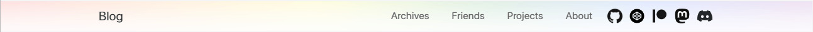

# 🌈 Rainbow Banner



Rainbow banner is enabled by default, and will only appear every June. You can customize it on your own to show your pride.

This is the default config:

```yaml
# rainbow!
rainbow_banner: true
rainbow_banner_colors:
  - '#e50000'
  - '#ff8d00'
  - '#ffee00'
  - '#008121'
  - '#004cff'
  - '#760188'
# choose from [auto, always]
rainbow_banner_shown: auto
# Pride Month by default
rainbow_banner_month: 6
```

## `rainbow_banner`

A `boolean`, the main switch of this feature. When `false`, all the configurations below will make no effects.

## `rainbow_banner_colors`

An `Array` of the colors of rainbow, from left to right, and has no amount limitation.

## `rainbow_banner_shown`

Choose from `auto` and `always`. If `always`, the rainbow banner will be shown at anytime. If `auto`, the banner will only be shown in `rainbow_banner_month`.

## `rainbow_banner_month`

A `Number` between `[1, 12]`, the month when the rainbow banner will be shown, only works with `rainbow_banner_shown: auto`.
