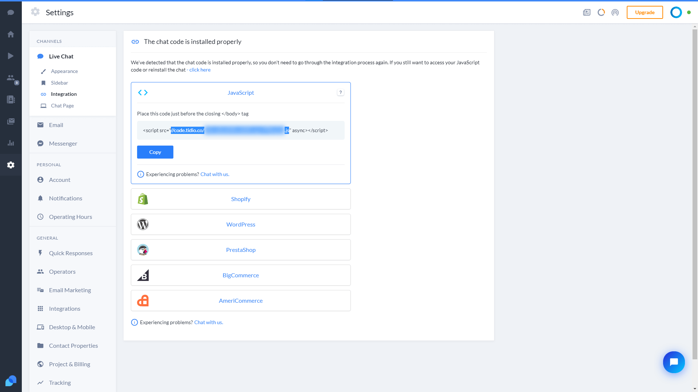

# Tidio Integration

We support installing Tidio to your blog.

1. Go to [Tidio Settings/Channels/Live Chat/Integration](https://www.tidio.com/panel/settings/live-chat/integration).
2. Click "click here".
3. Select "JavaScript".
4. Copy the URL in the code it provided.
   
5. Add `tidio` property to your blog configuration `_config.yml`:
   ```yml
   ...
   tidio: <the-url-you-copied-in-the-previous-step>
   ...
   ```
6. Done!
